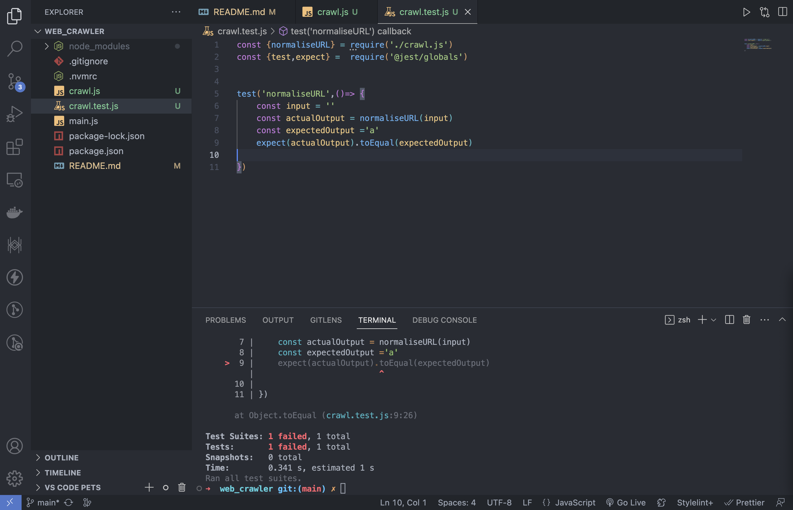
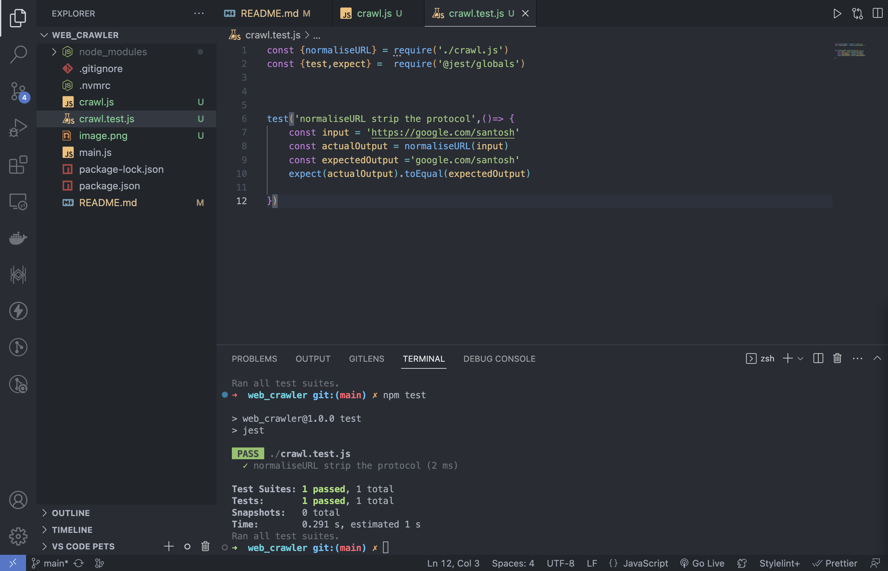

# web_crawler

Making a web_crawler

.nvmrc is for setting the node version

`nvm init ` for generating the json file(package.json), i am going to use .gitignore to ignore all the packages that might be installed while building this, so use `nvm install` , package.json is going to handle it all

modifed the script in package.json => `npm start ` for running, main.js is entry point

```
"scripts": {
    "start": "node main.js",
    "test": "echo \"Error: no test specified\" && exit 1"
  },
```

`npm install --save-dev jest` for developer only

adding node_modules to .gitignore as specified before `touch .gitignore`

```
 "test": "echo \"Error: no test specified\" && exit 1" to "jest"
```

`npm test`

Why normalise URLS [Cloudfare Docs](https://developers.cloudflare.com/rules/normalization/) => for `crawler.js` file

Test Driven Development:-<br/>
1.stub out the fn to be tested => stub code in crawl.js <br/>
2.write the test for the fn => test script in crawl.test.js , prefix is the filname.js for testing , jest looks for `test.js` in the directory <br/>
3.implement the fn <br/>



After modifying the crawl.js to take only the hostname+path, stripping the protocol


note for capials check in urls , the URL constructor in the `crawl.js` actually takes care of it

`npm install jsdom` <br/>
~ Read [JSDOM documenatation](https://www.google.com/search?q=jsdom+documentation&oq=JSDOM+documentation&aqs=chrome.0.0i512j0i15i22i30j0i390i650.5206j0j7&sourceid=chrome&ie=UTF-8)

