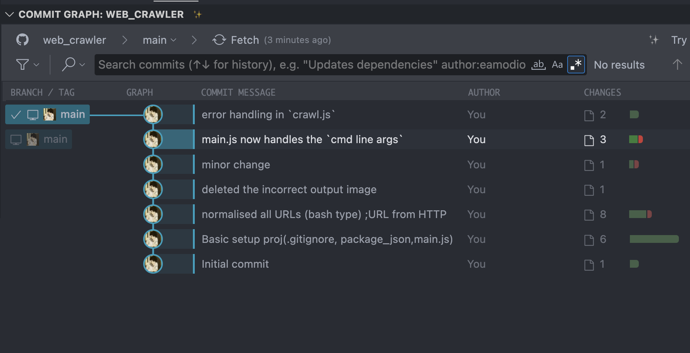
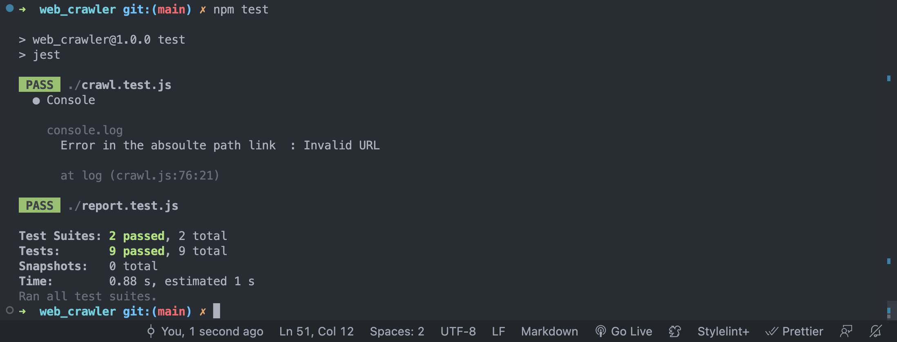
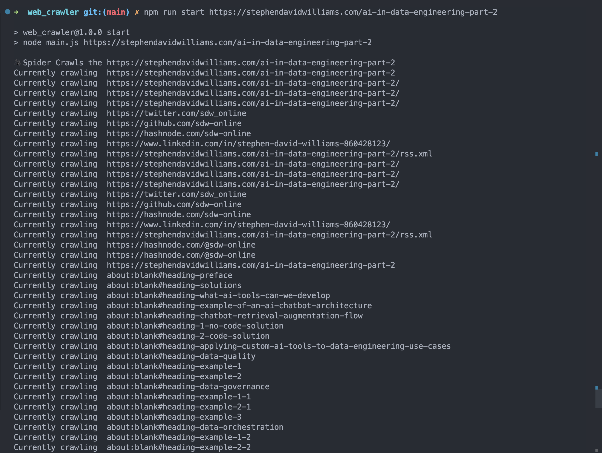
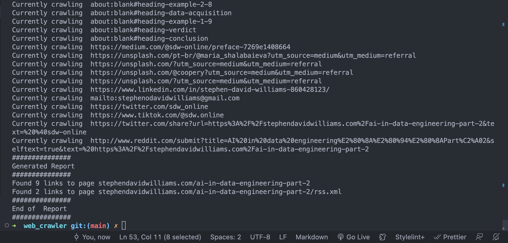
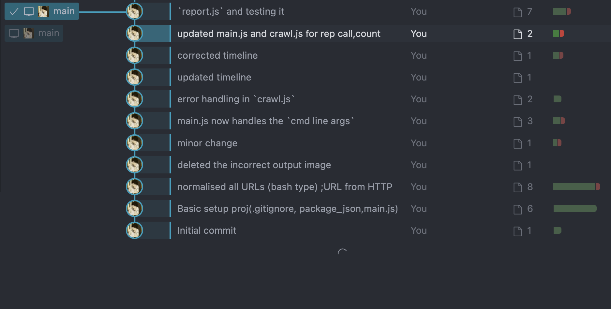

# web_crawler

Making a web_crawler

.nvmrc is for setting the node version

`nvm init ` for generating the json file(package.json), i am going to use .gitignore to ignore all the packages that might be installed while building this, so use `nvm install` , package.json is going to handle it all
`npm install --save-dev jest` for developer only
adding node_modules to .gitignore as specified before `touch .gitignore`

`npm install jsdom`  -- for getting urls by crawling <br/> 
~ Read [JSDOM documenatation](https://www.google.com/search?q=jsdom+documentation&oq=JSDOM+documentation&aqs=chrome.0.0i512j0i15i22i30j0i390i650.5206j0j7&sourceid=chrome&ie=UTF-8)


modifed the script in package.json => `npm start ` for running, main.js is entry point

```
"scripts": {
    "start": "node main.js",
    "test": "echo \"Error: no test specified\" && exit 1"
  },
```


```
 "test": "echo \"Error: no test specified\" && exit 1" to "jest"
```

`npm test`

Why normalise URLS [Cloudfare Docs](https://developers.cloudflare.com/rules/normalization/) => for `crawler.js` file


After modifying the crawl.js to take only the hostname+path, stripping the protocol


note for capials check in urls , the URL constructor in the `crawl.js` actually takes care of it


TIMELINE TILL NOW

~gitlens


Note all the Tests are done using jest
so `npm test`



Demo
`npm run start https://stephendavidwilliams.com/ai-in-data-engineering-part-2`




Note:- Although this crawler is working fine with most of the websites,
There is a website called Medium, crawling throught that website is making it loop endlessly, for this instead of incrementing the count of the already visited websites, we can<br>
1. Stop at a website which have all the link repeated from the already visited URLs
2. Stop a the exact moment the link is repeated <-- seems faulty in logic

I am thinking of implementing these two later

---
Recently started using gitlens therfore putting out the timeline once again

